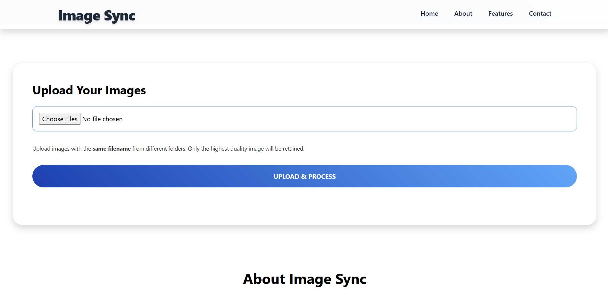

# 🖼️ Image Sync

**Image Sync** is a Django-based web application designed for seamless image uploads and background resizing. It intelligently detects duplicate images using an MD5 hash and uses Celery and Redis for asynchronous processing and caching.

---

## 🚀 Features

- Upload up to **two images** at once via a simple web interface.
- Background **asynchronous image resizing** using Celery workers.
- **Duplicate image detection** using MD5 hashes to prevent redundant uploads.
- **Redis caching** to avoid reprocessing the same image.
- Automatic resizing to **1920x1080** resolution.
- Display of all previously uploaded images.
- API support with **JSON responses**.

---

## 🧱 System Architecture

### 🔧 Components

- **Django** – Web framework for managing UI and backend logic.
- **Celery** – Handles background image processing tasks.
- **Redis** – Acts as a Celery broker and in-memory cache.
- **PostgreSQL/MySQL** – Stores metadata for uploaded images.
- **Pillow** – Python Imaging Library for image resizing.

### 🗺️ Data Flow

1. User uploads image(s).
2. Server checks for duplicates using MD5 hash.
3. Valid images trigger Celery tasks for resizing.
4. Resized image paths are cached in Redis.
5. Metadata is stored in the database.
6. Results are displayed on the frontend.

---

## 📦 Installation

```bash
git clone https://github.com/saimsajidirl/image-sync.git
cd image-sync
python -m venv venv
source venv/bin/activate
pip install -r requirements.txt
```

### 🔌 Start the Services

Make sure Redis server is running, then:

```bash
# Run Django development server
python manage.py runserver

# Start Celery worker
celery -A image_sync worker --loglevel=info
```

---

## 📸 Usage

Visit: `http://localhost:8000/upload-image/`

- Upload **exactly two** `.jpg`, `.jpeg`, or `.png` files using the modern web interface.
- If both images have the **same name**, they will be merged side by side and the merged image will be displayed in the UI, with a download link.
- If the images have **different names**, a message will be shown and no merge will occur.
- The UI is fully powered by JavaScript (AJAX/fetch), providing instant feedback and updates.
- All previously uploaded images are listed below the upload form.

---

## 🛠 Functional Requirements

- ✅ Upload validation for image format and size (max 5MB).
- ✅ Duplicate checking before storage.
- ✅ Asynchronous image processing (Celery).
- ✅ Redis caching to avoid duplicate processing.
- ✅ Display uploaded images on the UI.
- ✅ JSON API response with image statuses.

---

## ⚙️ Configuration

Set your environment variables:

```env

REDIS_URL=redis://localhost:6379
CELERY_BROKER_URL=redis://localhost:6379/0
DJANGO_SECRET_KEY=your_secret_key
```

## 🔐 Security

- Validates file types before upload.
- Authenticated uploads only (recommended).
- Exception handling with retry logic for failed tasks.

---

## 📜 License

This project is licensed under the MIT License.

---

## 🤝 Contributing

Contributions are welcome! Please fork the repository and submit a pull request.

---

## 📬 Contact

For support or business inquiries, contact: `saimsajidirl@gmail.com`
